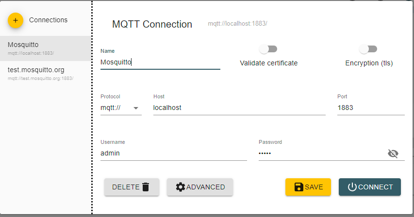

# IOT.-Simulator

Proyecto que simula la generación de datos de sensores de aire y agua, para ser almacenados en mongo y de series temporales, cratedb.

# Requisitos

En el equipo donde se ejecutará el servicio debe de tener instalado Docker apra levantar los contenedores.

# Instalación

Clonar el repositorio.

```bash
git clone https://github.com/oasrcode/iot-simulator.git
```

Entra en el directorio del proyecto.

```bash
cd iot-simulator
```

Levantar los contenedores.

```bash
docker-compose up -d --build
```

# Setup Mosquitto con Docker

Si quieres saber como se levanta el mosquitto broker.

## Contenido del `docker-compose.yml`

```yaml
version: "3.7"
services:
  mqtt5:
    image: eclipse-mosquitto
    container_name: mqtt-broker
    ports:
      - "1883:1883" 
      - "9001:9001" 
    volumes:
      - ./mosquitto/config:/mosquitto/config:rw
      - ./mosquitto/data:/mosquitto/data:rw
      - ./mosquitto/log:/mosquitto/log:rw
    restart: unless-stopped
  iot-agent:
    build: ./iot-agent
    container_name: iot-agent
    ports:
      - "8080:8080" 
    restart: unless-stopped
    depends_on: 
      - mqtt5
  api:
    build: ./api
    container_name: api
    ports:
      - "5000:5000" 
    restart: unless-stopped
    environment:
      - PORT=5000
      - MQTT_HOST=mqtt5
      - MQTT_PORT=1883
      - MQTT_USERNAME=admin
      - MQTT_PASSWORD=admin
      - MQTT_CLIENT_ID=iot_api
      - MONGO_URL=mongodb://mongo:27017
      - MONGO_USER=admin
      - MONGO_PASSWORD=admin
      - MONGO_DB=iot-dashboard
      - CRATE_HOST=cratedb
      - CRATE_PORT=5432
      - CRATE_USER=crate
    depends_on: 
      - mqtt5
      - iot-agent
      - mongo
      - cratedb  
  mongo:
    image: mongo
    container_name: mongo
    ports:
      - "27017:27017" 
    environment:
      - MONGO_INITDB_ROOT_USERNAME=admin
      - MONGO_INITDB_ROOT_PASSWORD=admin  
    volumes:
      - mongo-data:/data/db
    restart: unless-stopped
  cratedb:
    image: crate:latest
    container_name: crate
    ports:
      - "4200:4200"
      - "5432:5432"
    volumes:
      - crate-data:/tmp/crate/data 
    restart: unless-stopped
volumes:
  config:
  data:
  log:
  mongo-data:
  crate-data:

networks:
  default:
    name: iot-simulator
```

## Crear las carpetas necesarias

Crea una carpeta llamada `mosquitto` y dentro de ella crea las siguientes subcarpetas:

```yaml
Mode                 LastWriteTime         Length Name
----                 -------------         ------ ----
da----               25/05/2024 12:18              config
da----               25/05/2024 12:20              data
da----               25/05/2024 11:33              log
```

## Dentro de la carpeta `config`

Asegúrate de que la carpeta `config` contenga los siguientes archivos:

```yaml
Mode                 LastWriteTime         Length Name
----                 -------------         ------ ----
-a----               25/05/2024 12:20          200 mosquitto.conf
-a----               25/05/2024 12:20          119 pwfile
```

## Contenido de `mosquitto.conf`

```yaml
allow_anonymous false
listener 1883
listener 9001
protocol websockets
persistence true
password_file /mosquitto/config/pwfile
persistence_file mosquitto.db
persistence_location /mosquitto/data/
```

## Crear usuario y contraseña de `mosquitto.conf`

```yaml
docker exec -it mqtt5 mosquitto_passwd -c /mosquitto/config/pwfile admin
```

Otra vía en caso de error

```yaml
docker exec -it mqtt5  mosquitto_passwd -c chmod 0700 /mosquitto/config/pwfile admin
```

La contraseña será pedida tras hacer click en enter. Cambiar el mosquitto.conf allow_anonymous true

## Conexión con Mqtt Explorer




## API Endpoints

La API proporciona acceso a datos de sensores de calidad del aire y del agua. A continuación se describen los endpoints disponibles:

### Obtener Datos de Sensores de Aire

#### `GET /airSensors/:serialnumber`

* **Descripción:** Obtiene los datos del sensor de calidad del aire asociado al número de serie especificado.
* **Parámetros:**
  * `serialnumber` (obligatorio): Un código alfanumérico de 10 caracteres que identifica al sensor.
* **Respuestas:**
  * `200 OK`: Devuelve los datos del sensor de aire.
  * `400 Bad Request`: El número de serie no es válido.
  * `404 Not Found`: Sensor no encontrado.

#### `GET /airSensors`

* **Descripción:** Obtiene los datos de todos los sensores de calidad del aire almacenados en la base de datos.
* **Parámetros:** No requiere parámetros.
* **Respuestas:**
  * `200 OK`: Devuelve una lista con los datos de todos los sensores de aire.
  * `500 Internal Server Error`: Error al recuperar los datos.

### Obtener Datos de Sensores de Agua

#### `GET /waterSensors/:serialnumber`

* **Descripción:** Obtiene los datos del sensor de calidad del agua asociado al número de serie especificado.
* **Parámetros:**
  * `serialnumber` (obligatorio): Un código alfanumérico de 10 caracteres que identifica al sensor.
* **Respuestas:**
  * `200 OK`: Devuelve los datos del sensor de agua.
  * `400 Bad Request`: El número de serie no es válido.
  * `404 Not Found`: Sensor no encontrado.

#### `GET /waterSensors`

* **Descripción:** Obtiene los datos de todos los sensores de calidad del agua almacenados en la base de datos.
* **Parámetros:** No requiere parámetros.
* **Respuestas:**
  * `200 OK`: Devuelve una lista con los datos de todos los sensores de agua.
  * `500 Internal Server Error`: Error al recuperar los datos.

### Ejemplos de Números de Serie

A continuación se presentan ejemplos de números de serie válidos para los sensores:

* **Sensores de Aire:**
  * Serial: `0XP3XQ07VV`
  * Serial: `SPIWPJSZON`
* **Sensores de Agua:**
  * Serial: `MJBPICLTHG`
  * Serial: `XCVZ86U3LL`

### Notas

* Asegúrese de que el número de serie proporcionado en los endpoints que lo requieren cumpla con el formato especificado, ya que de lo contrario la API devolverá un error de validación.
* En caso de error, la API devolverá mensajes claros para facilitar la corrección de las solicitude
